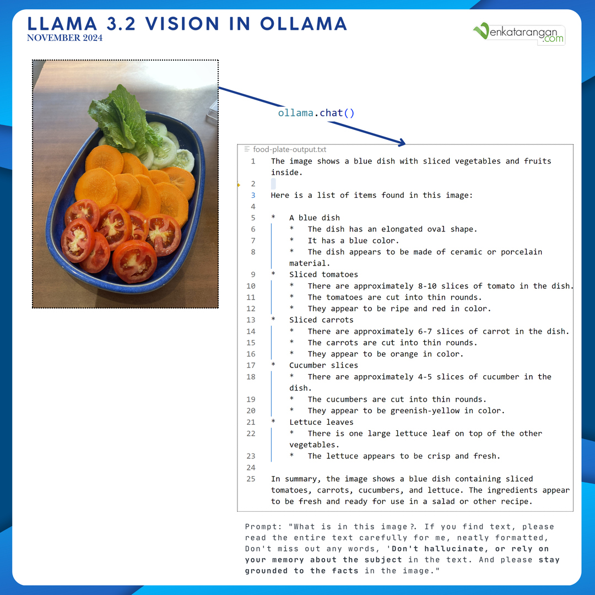

# LLAMA-VISION-CHAT

## Overview

`llama-vision-chat.py` is a Python script leveraging the Llama 3.2-Vision model to analyze images and generate detailed descriptions. The script can output the analysis to a file or display it directly in the console.

## Features

- Utilizes the Llama 3.2-Vision model for image analysis.
- Utilizes Ollama to run the model locally.
- Outputs analysis to a specified file or prints it to the console.
- Provides comprehensive descriptions of image content, including any text detected.

## Requirements

- Python 3.x
- Ollama 0.4.1

## Installation

1. Install the required Python package:
    ```sh
    pip install ollama
    ```

2. Pull the Llama 3.2-Vision model:
    ```sh
    ollama pull llama3.2-vision
    ```

## Usage

To execute the script, use the following command:

```sh
python llama-vision-chat.py <image_path> [output_file]
```

- `<image_path>`: The path to the image file to be analyzed.
- `[output_file]` (optional): The path to the output file where the response will be written. If not provided, the response will be printed to the console.

### Example

```sh
python llama-vision-chat.py food-plate.jpg food-plate-output.txt
```

This command analyzes the image `food-plate.jpg` and writes the response to `food-plate-output.txt`.

## Sample Outputs

Sample outputs from trial runs for two images are available in the `samples` folder.



## Script Details

### `analyze_image(image_path, output_file=None)`

Analyzes an image using the Llama 3.2-Vision model and writes the response to a file or prints it.

#### Parameters:

- `image_path` (str): The path to the image file to be analyzed.
- `output_file` (str, optional): The path to the output file where the response will be written. If not provided, the response will be printed.

#### Returns:

- None

### Main Entry Point

The script parses command-line arguments and invokes the `analyze_image` function.

#### Usage:

```sh
python llama-vision-chat.py <image_path> [output_file]
```

#### Arguments:

- `image_path` (str): The path to the image file to be analyzed.
- `output_file` (str, optional): The path to the output file where the response will be written. If not provided, the response will be printed.

## License

This project is licensed under the MIT License. See the LICENSE file for details.

## Acknowledgement

The foundational code was derived from a sample in Ollama's blog and subsequently enhanced using GitHub Copilot chat with several prompts utilizing GPT-4. Minor adjustments were made to improve and customize functionality.

## Disclaimer

This project is provided "as is" without any warranties or guarantees. The author assumes no responsibility or liability for:
- The accuracy, reliability, or completeness of any outputs generated by the code
- Any misuse or misinterpretation of the results
- Any issues arising from the use of third-party packages including but not limited to Llama and Ollama
- Any decisions or actions taken based on the image analysis results

This software is intended for educational and learning purposes only. Users should exercise their own judgment when interpreting results. The underlying AI models may produce incorrect, incomplete, or biased outputs.

All trademarks, logos, model names, and brand names mentioned are the property of their respective owners.